# Intro to CI/CD Tutorial

This document will walk through implementing a simple CI/CD pipeline into a codebase using [CircleCI](https://circleci.com/).
The following will be demonstrated:

- Integrating CircleCI with a GitHub project
- A unittest for a Node.js Express.js application
- Implementing a CI/CD pipeline in the codebase using a CircleCI config file in the project
- Building a Docker image
- Deploy the Docker image to [Docker Hub](https://hub.docker.com)

## Prerequisites

Before you get started you'll need to have these things:

- [GitHub Account](https://github.com/join)
- [CircleCI](https://circleci.com/signup/) account
- [Docker Hub account](https://hub.docker.com)
- Fork then clone the [cicd-101-workshop repo](https://github.com/datapunkz/nodejs-cicd-workshop) locally

 After you have all the prerequisites complete you're ready to proceed to the next section.

## CI/CD Pipeline using CircleCI

Now that the application and unit tests have been explained, it's time to implement a CI/CD pipeline into the codebase. Implementing a CI/CD pipeline using CircleCI is very simple. 

CircleCI integration is completed in basically two steps. 

1. Set up project access in CircleCI dashboard
2. Define your CI/CD Builds a `config.yml` file

Once project's are setup in the CircleCI platform any commits pushed upstream to the codebase will be detected and CircleCI will execute the job defined in your `config.yml` file which is discussed in the next section.

Before continuing ensure the [Prerequisites](#Prerequisites) section is completed. 

### .circleci/config.yml

The config.yml is where all of the CI/CD magic happens. The config.yml **must** reside in a subdirectory named `.circleci/`. Below is an example of the config.yml used in this tutorial with a brief explanation of the syntax:

```yaml
version: 2
jobs:
  build_test:
    docker:
      - image: circleci/node:10
    steps:
      - checkout
      - run:
          name: Run Tests
          command: |
            npm install ejs express request mocha --save
            npm test
  deploy:
    docker:
      - image: circleci/node:10
    steps:
      - checkout
      - setup_remote_docker:
          docker_layer_caching: false
      - run:
          name: Build and push image to Docker Hub
          command: |       
            echo 'export TAG=0.1.${CIRCLE_BUILD_NUM}' >> $BASH_ENV
            echo 'export IMAGE_NAME=nodejs-cicd-workshop' >> $BASH_ENV
            source $BASH_ENV
            docker build -t $DOCKER_LOGIN/$IMAGE_NAME -t $DOCKER_LOGIN/$IMAGE_NAME:$TAG .
            echo $DOCKER_PWD | docker login -u $DOCKER_LOGIN --password-stdin
            docker push $DOCKER_LOGIN/$IMAGE_NAME
workflows:
  version: 2
  build_test_deploy:
    jobs:
      - build_test
      - deploy:
          requires:
            - build_test

```

This `config.yml` file uses the [CircleCI Workflows features](https://circleci.com/docs/2.0/workflows/#overview) which is a set of rules for defining a collection of jobs and their run order. Workflows support complex job orchestration using a simple set of configuration keys to help you resolve failures sooner. The workflow in this example will be discussed later in this tutorial.

The `jobs:` key represents a list of jobs that will be run.  A job encapsulates the actions to be executed. You can get more details about [jobs and builds here](https://circleci.com/docs/2.0/configuration-reference/#jobs)

The `build_test:` key is composed of a few elements:

- docker:
- steps:

The `docker:` key tells CircleCI to use a [docker executor](https://circleci.com/docs/2.0/configuration-reference/#docker) which means our build will be executed using docker containers.

`image: circleci/node:10` specifies the docker image that the build must use

### steps: 

The `steps:` key is a collection that specifies all of the commands that will be executed in this build. The first action that happens the `- checkout` command that basically performs a git clone of your code into the build environment.

The `- run:` keys specify commands to execute within the build.  Run keys have a `name:` parameter where you can label a grouping of commands. For example `name: Run Tests` groups the test related actions which helps organize and display build data within the CircleCI dashboard.

**Important NOTE:** Each `run` block is equivalent to separate/individual shells or terminals so commands that are configured or executed will not persist in latter run blocks. Use the `$BASH_ENV` work around in the [Tips & Tricks section](https://circleci.com/docs/2.0/migration/#tips-for-setting-up-circleci-20)

```yaml
- run:
    name: Run Tests
    command: |
    npm install ejs express request mocha --save
    npm test 
```            

In this run block the command installs the application dependencies and executes tests against the application and if these tests fail the entire build will fail and will require the developers to fix their code and commit the changes.

## Deploy Job

Once the application is built and tested you should think about deploying the application to your target environment. The target deployment environment for this pipeline is [Docker Hub](https://hub.docker.com/).  The next job in this config.yml is the `deploy:` key

```yaml
  deploy:
    docker:
      - image: circleci/node:10
    steps:
      - checkout
      - setup_remote_docker:
          docker_layer_caching: false
      - run:
          name: Build and push image to Docker Hub
          command: |       
            echo 'export TAG=0.1.${CIRCLE_BUILD_NUM}' >> $BASH_ENV
            echo 'export IMAGE_NAME=nodejs-cicd-workshop' >> $BASH_ENV
            source $BASH_ENV
            docker build -t $DOCKER_LOGIN/$IMAGE_NAME -t $DOCKER_LOGIN/$IMAGE_NAME:$TAG .
            echo $DOCKER_PWD | docker login -u $DOCKER_LOGIN --password-stdin
            docker push $DOCKER_LOGIN/$IMAGE_NAME
```

The `docker:`, `steps:` and `checkout` are declared and function the same as the keys defined in the previous `build_test:` job so ext we'll cover the `- setup_remote_docker:` key.

```yaml
- setup_remote_docker:
    docker_layer_caching: true
```

A requirement of this pipeline is to build a Docker image based on the app and pushing that image to Docker Hub. This run block specifies the [setup_remote_docker:](https://circleci.com/docs/2.0/glossary/#remote-docker) key which is a feature that enables building, running and pushing images to Docker registries from within a Docker executor job. When docker_layer_caching is set to true, CircleCI will try to reuse Docker Images (layers) built during a previous job or workflow. That is, every layer you built in a previous job will be accessible in the remote environment. However, in some cases your job may run in a clean environment, even if the configuration specifies `docker_layer_caching: true`.

The `command:` key for this run block has a list of commands to execute. These commands set the `$TAG` & `IMAGE_NAME` custom environment variables that will be used throughout this build. 

```yaml
- run:
    name: Build and push image to Docker Hub
    command: |       
    echo 'export TAG=0.1.${CIRCLE_BUILD_NUM}' >> $BASH_ENV
    echo 'export IMAGE_NAME=nodejs-cicd-workshop' >> $BASH_ENV
    source $BASH_ENV
    docker build -t $DOCKER_LOGIN/$IMAGE_NAME -t $DOCKER_LOGIN/$IMAGE_NAME:$TAG .
    echo $DOCKER_PWD | docker login -u $DOCKER_LOGIN --password-stdin
    docker push $DOCKER_LOGIN/$IMAGE_NAME
```

The **Build and push Docker image** run block specifies the commands that package the application into a single binary using pyinstaller then continues on to the Docker image building process.

```yaml
docker build -t $DOCKER_LOGIN/$IMAGE_NAME -t $DOCKER_LOGIN/$IMAGE_NAME:$TAG .
echo $DOCKER_PWD | docker login -u $DOCKER_LOGIN --password-stdin
docker push $DOCKER_LOGIN/$IMAGE_NAME
```

The `echo $DOCKER_PWD | docker login -u $DOCKER_LOGIN --password-stdin` command uses the $DOCKER_LOGIN and $DOCKER_PWD env variables set in the CircleCI dashboard as credentials to login & push this image to Docker Hub.

These commands build the docker image based on the `Dockerfile` included in the repo. [Dockerfile](https://docs.docker.com/engine/reference/builder/) is the instruction on how to build the Docker image.

```yaml
FROM node:10

# Create app directory
WORKDIR /usr/src/app

# Install app dependencies
# A wildcard is used to ensure both package.json AND package-lock.json are copied
# where available (npm@5+)
COPY package*.json ./

RUN npm install
# If you are building your code for production
# RUN npm install --only=production

# Bundle app source
COPY . .

EXPOSE 5000
CMD [ "npm", "start" ]
```

## Hands On with CircleCI

The `config.yml` file has been explained in detail and provides an initial understanding of how code bases, CI/CD concepts and using CircleCI to facilitate pipelines. The rest of this document will demonstrate how to integrate CircleCI into a user's CircleCI profile and executing CI/CD builds. The [cicd-101-workshop repo](https://github.com/datapunkz/nodejs-cicd-workshop/tutorial/cicd_101_guide.md) will be used in this example.

### Add Project to CircleCI

In order for the CircleCI platform to integrate with projects it must have access to the codebase. This section demonstrates how to give CircleCI access to a project on Github via the CircleCi dashboard.

- Login to the [dashboard](http://circleci.com/vcs-authorize/)
- Click the **Add Project** icon on the left menu
- Choose the appropriate GitHub org from the dropdown in the top left

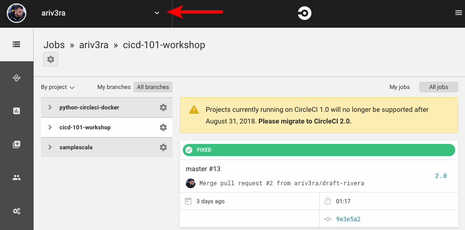

- Find your GitHub project in the list
- Click the corresponding **Set Up Project** button on the right 

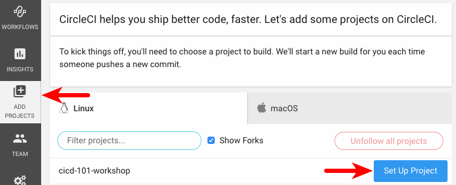

- On the `Set Up Project Section` click the **Other** button

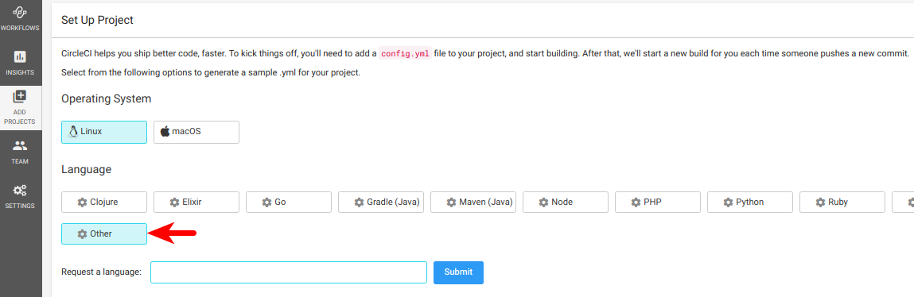

- Scroll down then click the **Start Building** button

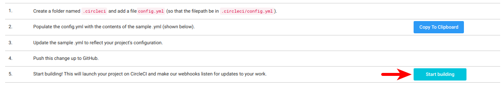

### Set Project Level Environment Variables

The build **will** fail because the CircleCI configuration uses environment variables `$DOCKER_LOGIN` and `$DOCKER_PWD` that are not configured. The following demonstrates how to set these variables.

- Click the project settings **cog** icon on the right

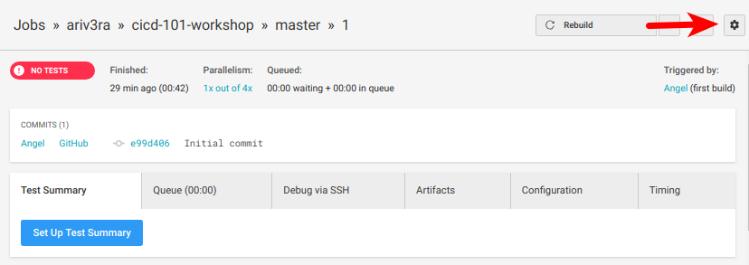

- From the `Project Overview` page click **Environment Variables** on the left

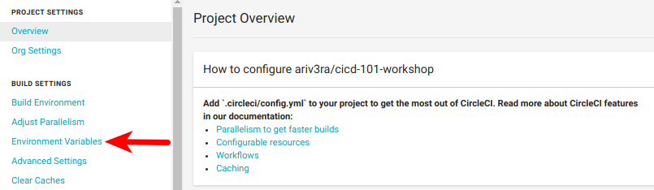

- Click **Add Variable** button

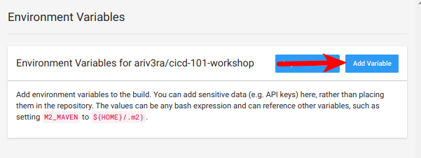

- Enter `DOCKER_LOGIN` in the **Name** field
- Enter your Docker Hub username in the **Value** field (Don't use your email address)
- Click **Add Variable** button

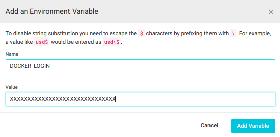

- Click the **Add Variable** button again
- Enter `DOCKER_PWD` in the **Name** field
- Enter your Docker Hub Password in the **Value** field
- Click **Add Variable** button

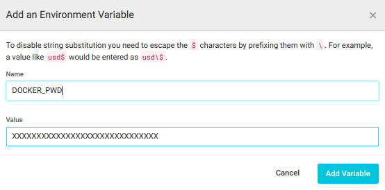  

The Environment Variables are defined and the build should now complete when rebuilt.

### Rebuild the Project

The project is properly configured and will build Green on the next run. To manually rebuild the failed project:

- Click the **Rebuild** button on the top right

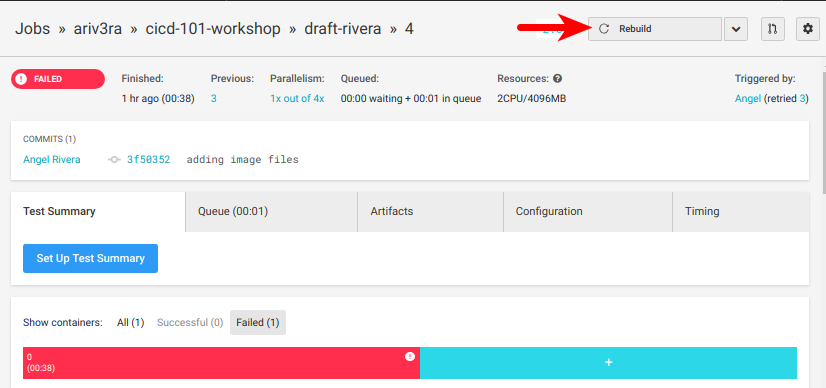

This run should produce a Green build!

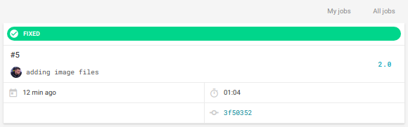

### Docker Hub

The Green build means that a new Docker image was created and pushed to the user's Docker Hub account. The newly created Docker image should be visible in the user's Docker hub tagged with the latest build number.

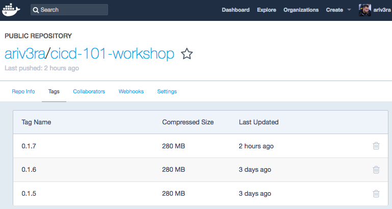

## Continuous Delivery/Deployment

Using the automation offered by CircleCI this project pushed the Docker image to the user's Docker Hub. The final requirement for this pipeline is to push a stable version of the application to Docker Hub which constitutes Continuous Deployment. If there would've been a manual action or user intervention required in this pipeline then it would be considered Continuous **Delivery** which is appropriate in situations where a review or an approval is required prior to actually deploying applications.

## Summary

In review this tutorial guides you in implementing a CI/CD pipeline into a codebase. Though this example is built using python technologies the general build, test and deployment concepts can easily be implemented in whatever language or framework you desire. The examples in this tutorial are simple but you can expand on them and tailor them to your pipelines. CircleCI has great [documentation](https://circleci.com/docs/2.0/) so don't hesitate to research the docs site and if you really get stuck you can also reach out to the CircleCI community via the [https://discuss.circleci.com/](https://discuss.circleci.com/) community/forum site.
